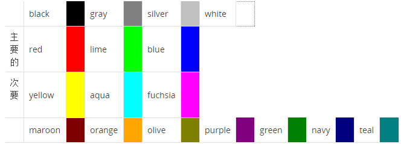
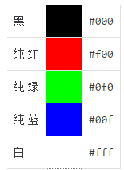
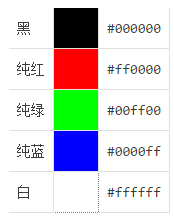
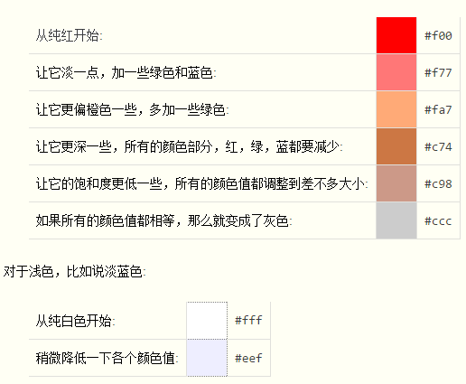
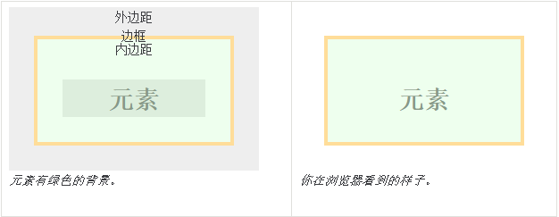
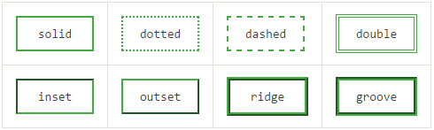

该笔记全部摘录自[MDN CSS入门教程](https://developer.mozilla.org/zh-CN/docs/Web/Guide/CSS/)

#层叠和样式（CSS基础知识）

对于层叠来说，共有三种主要来源：

* 浏览器对HTML定义的默认样式
* 用户定义的样式
* 开发者定义的样式，可以有三种形式:
 + 定义在外部文件（外联样式）
 + 在页面的头部定义（内联样式）：只在本页面内生效
 + 定义在特定的元素身上（行内样式）：多用于测试，可维护性差

优先级：网页开发者定义的样式>网页阅读者定义的样式>浏览器的默认样式

## 选择器

* 类选择器：通过设置元素的 class 属性，可以为元素指定类名。类名由开发者自己指定。 文档中的多个元素可以拥有同一个类名。在写样式表时，类选择器是以英文句号（.）开头的。
* ID选择器：通过设置元素的 id 属性为该元素制定ID。ID名由开发者指定。每个ID在文档中必须是唯一的。在写样式表时，ID选择器是以#开头的。

优先级，ID选择器>类选择器>标签选择器。冲突规则后出现的规则优先级高（就近原则）。

### 伪类选择器
CSS伪类（pseudo-class）是加在选择器后面的用来指定元素状态的关键字。比如，:hover 会在鼠标悬停在选中元素上时应用相应的样式。

伪类和伪元素（pseudo-elements）不仅可以让你为符合某种文档树结构的元素指定样式，还可以为符合某些外部条件的元素指定样式：浏览历史(比如是否访问过 (:visited)， 内容状态(如 :checked ), 鼠标位置 (如:hover). 

### 基于关系的选择器

|选择器|选择的元素|
|:------:|:------------|
|A E|元素A的任一后代元素E (后代节点指A的子节点，子节点的子节点，以此类推)|
|A > E|元素A的任一子元素E(也就是直系后代)|
|E:first-child|任一是其父母结点的第一个子节点的元素E|
|B + E|元素B的任一下一个兄弟元素E|
|B ~ E|B元素后面的拥有共同父元素的兄弟元素E|

（*）可以用来表示任意元素。

基于关系的选择器和伪类选择器构造纯CSS下拉菜单，示例：

``` css
div.menu-bar ul ul {
  display: none;
}

div.menu-bar li:hover > ul {
  display: block;
}
```

``` html
<div class="menu-bar">
  <ul>
    <li>
      <a href="example.html">Menu</a>
      <ul>
        <li>
          <a href="example.html">Link</a>
        </li>
        <li>
          <a class="menu-nav" href="example.html">Submenu</a>
          <ul>
            <li>
              <a class="menu-nav" href="example.html">Submenu</a>
              <ul>
                <li><a href="example.html">Link</a></li>
                <li><a href="example.html">Link</a></li>
                <li><a href="example.html">Link</a></li>
                <li><a href="example.html">Link</a></li>
              </ul>
            </li>
            <li><a href="example.html">Link</a></li>
          </ul>
        </li>
      </ul>
    </li>
  </ul>
</div>
```

## 创建可读性良好的CSS

可以通过添加空白字符和注释来提高样式表的可读性。空白字符可以空格、tab字符和换行。

CSS注释以/\*开始，以\*/结束。

### 选择器组

当多元素具有相同的样式时，需要定义一个选择器组，组内用逗号分隔。

Example:

``` css
/* color for headings */
h1, h2, h3 {color: navy;}
```

## 文本样式
使用简写属性[font](https://developer.mozilla.org/zh-CN/docs/Web/CSS/font)可以很方便的指定其他的字体属性。

### 字体
你无法预料到用户是否可以访问样式表里定义的字体。所以在设置字体时，在属性后指定一个替代的字体列表。

在这个字体列表的最后加上系统字体中的一个，如：serif,sans-serif,cursive,fantasy或monospace。

如果字体不支持样式表里设置的字体特征，浏览器会使用另一种字体。比如，样式表中包含字体不支持的特殊字符，如果浏览器发现另一种字体支持这些特殊字符，那浏览器就会选择使用这种字体。
使用[font-family](https://developer.mozilla.org/zh-CN/docs/Web/CSS/font-family)属性指定文本的字体。

### 字号
可以使用系统内置的值来设置字号，如small，medium和large。也可以使用相对父元素字号大小的值来设置，如smaller，larger，150%或1.5em。1“em”等于1个字母“m”的宽度（相对于父元素字号大小）;因此1.5em就是1.5倍的父元素字号大小。

如果有必要你也可以指定一个实际的大小，比如14px(14像素)应用于显示设备或14pt(14点)应用于打印设备。但是实际大小不能应用于视力受损用户的设备上，因为这些设备不支持指定实际的值。一个比较容易实现的策略是给顶级的文档元素指定一个系统内置的值如medium，然后再给它的子元素设置个相对值。

使用[font-size](https://developer.mozilla.org/zh-CN/docs/Web/CSS/font-size)属性指定字体的大小。

### 行高
行高用来指定行与行之间的距离。如果你的文档中有一个很长的段落由很多行组成，而且这个段落的字号还比较小，这时给它指定一个稍大的间距，这样阅读起来会更方便。

使用[line-height](https://developer.mozilla.org/zh-CN/docs/Web/CSS/line-height)属性指定文本的行间距

### 装饰
单独的[text-decoration](https://developer.mozilla.org/zh-CN/docs/Web/CSS/text-decoration)就可以为文本指定其他风格，比如underline或line-through。你也可以把值设置成none，把这些风格取消掉。

### 其他属性
使用[font-style](https://developer.mozilla.org/zh-CN/docs/Web/CSS/font-style): italic;指定文本为斜体;

使用[font-weight](https://developer.mozilla.org/zh-CN/docs/Web/CSS/font-weight): bold;指定文本加粗;

使用[font-variant](https://developer.mozilla.org/zh-CN/docs/Web/CSS/font-variant): small-caps;指定文本为小型大写字母;

如果我们想单独设置某个效果失效，我们可以把其相应的属性设置为normal或inherit.

## 颜色
CSS2支持17种名字的颜色，如下图：



除了名称之外，可以使用代表红绿蓝三颜色的16进制数字表示，分别有3位和6位表示法。





可以通过调整三位数字来得到不同颜色：



还能够通过RGB值（0-255或者是百分比值），来得到颜色。

### 颜色属性
除了[color](https://developer.mozilla.org/zh-CN/docs/Web/CSS/color)属性.

同样可以使用[background-color](https://developer.mozilla.org/zh-CN/docs/Web/CSS/background-color)属性来改变元素的背景色.

背景色可以设置transparent属性来移除掉所有的颜色，呈现出父元素的背景色

## 信息：内容
在样式中可以定义文本内容和图片内容。当内容与文档结构紧密相关的时候，你可以在样式表中指定内容。

### 文本内容
CSS可以在元素的前后插入文本：在选择器的后面加上[::before](https://developer.mozilla.org/zh-CN/docs/Web/CSS/::before)或者[::after](https://developer.mozilla.org/zh-CN/docs/Web/CSS/::after)。在声明中，指定[content](https://developer.mozilla.org/zh-CN/docs/Web/CSS/content)属性，并设置文本内容。

``` css
.ref::before {
  font-weight: bold;
  color: navy;
  content: "Reference: ";
}
```

样式表默认使用UTF-8字符集。

### 图片内容
可以通过将[content](https://developer.mozilla.org/zh-CN/docs/Web/CSS/content)属性值设置为某个图片的URL，可以将图片插到元素的前面或后面。

下面这条规则在所有类名包含glossary的a标签后面插入一个空格和一个图标：

``` css
a.glossary::after {content: " " url("../images/glossary-icon.gif");}
```

将图片设置成元素的背景图：将[background](https://developer.mozilla.org/zh-CN/docs/Web/CSS/background)的值设为图片的URL。这是同时设置背景颜色，背景图，图片如何重复等的快捷写法。

这条规则通过指定图片URL设置特定元素的背景。

这是一个ID选择器；no-repeat表示背景图只出现一次，不重复:

``` css
#sidebar-box {background: url("../images/sidebar-ground.png") no-repeat;}
```

## 信息：列表
使用[list-style](https://developer.mozilla.org/zh-CN/docs/Web/CSS/list-style)属性来指定列表项标记的样式。

### 无序列表
CSS有三种标记样式：

* disc

+ circle

- square

### 有序列表
在有序列表中，每个列表项都被标记了不同的序号。

用[list-style](https://developer.mozilla.org/zh-CN/docs/Web/CSS/list-style)属性指定标记样式：

* decimal
* lower-roman
* upper-roman
* lower-latin
* upper-latin

### 计数器（略）

## 盒模型（重点）
当你的浏览器展现一个元素时，这个元素会占据一定的空间。这个空间由四部分组成。

中间是*元素*呈现内容的区域。这个区域的外面是*内边距*。再外面是*边框*。最外面的是*外边距*，外边距将该元素与其它元素分开。

### 颜色
内边距总是跟元素的背景色一样，所以当你设置背景色时，你会发现背景色在元素本身和内边距上都生效了。外边距总是透明的。



### 边框
可以用边线或者边框来装饰元素。

用 border 属性给元素四周指定统一的边框。在属性值中指定边框的宽度（通常是以显示到屏幕上的像素为单位）， 样式， 还有颜色。

样式包括：



你也可以通过设置样式为 none 或 hidden 来明确地移除边框，或者设置边框颜色为 transparent 来让边框不可见，后者不会改变布局。

如果一次只指定某一个方向的边框，就用属性： `border-top`， `border-right`， `border-bottom`， `border-left`。 你可以用这些属性指定某个方向上的边框，或者不同方向上的不同边框。

### 边距
用 margin 属性或者 padding 属性分别设置外边距和内边距的宽度。
边距指定顺序是：上、右、下、左。

## 布局

### 文档结构
可以使用\<div\>元素来创建结构（容器）。

### 大小单位
最好使用百分比或ems（em）来指定大小。em 通常是指当前字体大小(字母m的宽度)。当用户改变字体大小时，布局会自己修正。

### 文本布局
有两个属性可以指定元素内容的对齐方式。你可以用它们来进行简单的布局:

[text-align](https://developer.mozilla.org/zh-CN/docs/Web/CSS/text-align)

内容对齐。 可[以使用下面几个值： left, right, center, justify。

[text-indent](https://developer.mozilla.org/zh-CN/docs/Web/CSS/text-indent)

指定内容缩进。

这两个属性可以应用于任何文本类内容，不只是纯文本。 需要注意的是，它们会被元素的子元素继承， 所以需要在子元素中将它们关闭，以免出现意想不到的效果

### 浮动(重要)
[float](https://developer.mozilla.org/zh-CN/docs/Web/CSS/float)属性强制元素靠左或靠右。 这是控制元素位置和大小的简单方法。

使用[clear](https://developer.mozilla.org/zh-CN/docs/Web/CSS/clear)属性可以避免其它元素受到浮动效果的影响。

### 位置
可以为一个元素指定[position](https://developer.mozilla.org/zh-CN/docs/Web/CSS/position)属性为以下值之一，来设置其位置。

- relative：通过为元素指定一个值，元素相对于其原来位置移动。也可以使用margin来达到同样的效果。
- fixed：为元素指定相对于窗口的确切位置 。即使文档的其它元素出现滚动，元素位置仍然不变。
- absolute：为元素指定相对于其父元素的确切位置。只有在父元素使用 relative, fixed or absolute 时才有效。你可以为任何父元素指定 position: relative;因为它不会产生移动。
- static：默认值。当明确要关闭位置属性时使用。

和position属性(除了static)一起使用的, 有下列属性: top, right, bottom, left, width, height 通过设置它们来指定元素的位置或大小。

## 信息：表格
表格结构：表格开始的特定的行组是表头（header: `<thead>`）。表格最后的特定行组是表尾（footer: `<tfoot>`）。表格中主要的行就是表体（body: `<tbody>`），这些表体也可能被分组。

### 边框
单元格没有外边距。

但是单元格有边框和内边距。默认情况下，边框被表格的[border-spacing](https://developer.mozilla.org/zh-CN/docs/Web/CSS/border-spacing)属性值间隔。你也可以通过设置表格的[border-collapse](https://developer.mozilla.org/zh-CN/docs/Web/CSS/border-collapse)属性值为collapse来完全移除间隔。

	标题

	`<caption>`元素是用在整个表格的一个标签。默认下，它显示在表格的顶部。

	可以设置<caption>的caption-side属性值为bottom来将标签移到表格的底部。

	想要样式化caption的文本，可以使用任何常规的文本属性。

	空单元格

	你可以通过为表格元素指定empty-cells属性值show来显示空单元格（就是其边框和背景）。

	你也可以指定[empty-cells](https://developer.mozilla.org/zh-CN/docs/Web/CSS/empty-cells): hide;来隐藏边框和背景，那么如果一个单元格的父元素设置了背景，背景将通过空单元格显示出来。

一个标准表格实例：

``` html
<table id="demo-table">
  <caption>Oceans</caption>
  <thead>
    <tr>
      <th></th>
      <th>Area</th>
      <th>Mean depth</th>
    </tr>
    <tr>
      <th></th>
      <th>million km<sup>2</sup></th>
      <th>m</th>
    </tr>
  </thead>
  <tbody>
    <tr>
      <th>Arctic</th>
      <td>13,000</td>
      <td>1,200</td>
    </tr>
    <tr>
      <th>Atlantic</th>
      <td>87,000</td>
      <td>3,900</td>
    </tr>
    <tr>
      <th>Pacific</th>
      <td>180,000</td>
      <td>4,000</td>
    </tr>
    <tr>
      <th>Indian</th>
      <td>75,000</td>
      <td>3,900</td>
    </tr>
    <tr>
      <th>Southern</th>
      <td>20,000</td>
      <td>4,500</td>
    </tr>
  </tbody>
  <tfoot>
    <tr>
      <th>Total</th>
      <td>361,000</td>
      <td></td>
    </tr>
    <tr>
      <th>Mean</th>
      <td>72,000</td>
      <td>3,800</td>
    </tr>
  </tfoot>
</table>
```

``` css
/*** Style for doc3.html (Tables) ***/

#demo-table {
  font: 100% sans-serif;
  background-color: #efe;
  border-collapse: collapse;
  empty-cells: show;
  border: 1px solid #7a7;
}

#demo-table > caption {
  text-align: left;
  font-weight: bold;
  font-size: 200%;
  border-bottom: .2em solid #4ca;
  margin-bottom: .5em;
}


/* basic shared rules */
#demo-table th,
#demo-table td {
  text-align: right;
  padding-right: .5em;
}

#demo-table th {
  font-weight: bold;
  padding-left: .5em;
}


/* header */
#demo-table > thead > tr:first-child > th {
  text-align: center;
  color: blue;
}

#demo-table > thead > tr + tr > th {
  font-style: italic;
  color: gray;
}

/* fix size of superscript */
#demo-table sup {
  font-size: 75%;
}

/* body */
#demo-table td {
  background-color: #cef;
  padding:.5em .5em .5em 3em;
}

#demo-table tbody th:after {
  content: ":";
}


/* footer */
#demo-table tfoot {
  font-weight: bold;
}

#demo-table tfoot th {
  color: blue;
}

#demo-table tfoot th:after {
  content: ":";
}

#demo-table > tfoot td {
  background-color: #cee;
}

#demo-table > tfoot > tr:first-child td {
  border-top: .2em solid #7a7;
}
```

## [信息：媒体](https://developer.mozilla.org/zh-CN/docs/Web/Guide/CSS/Getting_Started/Media)
CSS的作用是将网页文档以更友好的展现方式呈现给用户。

例如，假设你现在正用一台显示设备来阅读这篇文章，同时你也想把它投影到屏幕上，或者打印出来，而显示设备、屏幕投影和打印等这些媒介都有自己的特点，CSS就是为文档提供在不同媒介上展示的适配方法。

CSS通过使用[@media](https://developer.mozilla.org/zh-CN/docs/Web/CSS/@media)的格式来对特定的媒介指定适配规则。

### 打印（略）

### 用户界面
CSS有一些特殊的属性能够支持设备的用户界面，像电脑显示器。这使得文档的展示随着用户界面的情况而动态地变化。

并没有针对用户界面设备的特殊媒介类型。

下面有五种特殊的选择器:

|Selector|Selects|
|:------|:---------|
|E:[hover](https://developer.mozilla.org/zh-CN/docs/Web/CSS/:hover)|当鼠标悬浮在任何E元素上|
|E:[focus](https://developer.mozilla.org/zh-CN/docs/Web/CSS/:focus)|当元素获得键盘焦点|
|E:[active](https://developer.mozilla.org/zh-CN/docs/Web/CSS/:active)|当元素是当前的活动元素|
|E:[link](https://developer.mozilla.org/zh-CN/docs/Web/CSS/:link)|当元素超链接到一个url但是用户还没有访问过|
|E:[visited](https://developer.mozilla.org/zh-CN/docs/Web/CSS/:visited)|当元素超链接到一个url但是用户已经访问过|

 cursor 属性指定鼠标的形状：一些常见的形状如下表所示。把你的鼠标放在列表的选项上来看浏览器中实际显示的鼠标形状:

|Selctor|Selects|
|:------|:---------|
|pointer|指示超链接|
|wait|表明程序无法接受输入|
|progress|表明程序正在运行|
|default|默认（通常是箭头）|

[outline](https://developer.mozilla.org/zh-CN/docs/Web/CSS/outline)属性通过创建轮廓来表明获得键盘焦点。只有在父元素使用 relative, fixed or absolute 时才有效。你可以为任何父元素指定 position: relative;因为它不会产生移动。
它的作用相当于[border](https://developer.mozilla.org/zh-CN/docs/Web/CSS/border)属性，但与其不同的是它不能指明个别方向。

一些其他的用户界面特性通常会通过属性来应用。例如，禁用或者只读的元素可以设置 disabled 属性和 readonly 属性。选择器可以通过方括: [disabled] 或者 [readonly]来指定这些属性。

示例，这些规则规定了按钮在用户使用时动态变化的样式:

``` css
.green-button {
  background-color:#cec;
  color:#black;
  border:2px outset #cec;
  }

.green-button[disabled] {
  background-color:#cdc;
  color:#777;
  }

.green-button:active {
  border-style: inset;
  } 
```

